# gpt_engine_2.0

This repository automates ChatGPT signup/login flows using SeleniumBase (pure CDP),
Boomlify for OTP email, and Supabase for account storage.

Below is a per-file guide that explains:
- inputs, outputs, and return logic
- I/O operations (browser, network, filesystem)
- a small "picture" (Mermaid diagram) per file showing the I/O flow

Screenshots are written to `screenshots/` using `save_ss()` in `utils.py`.

---

**I/O Legend**
- Browser I/O: CDP-controlled browser actions (ChatGPT/Boomlify)
- Network I/O: Supabase REST calls
- File I/O: screenshots

---

**access_keys.py**
Purpose: Supabase CRUD helpers for `chatgpt_accounts`.

Inputs / Outputs:
- `_req(method, params=None, json=None)` -> JSON list/dict (or `None`)
- `get_available_account()` -> dict `{email,password,index}` or `None`
- `get_password(email)` -> password string or `None`
- `update_password(email, new_password)` -> `True`
- `release_account(email)` -> `True`
- `add_email_row(email, password=None, is_in_use=False)` -> `True` on insert, `False` if already exists

Return logic:
- `add_email_row` returns `False` if the email already exists or if insert fails after retries.

I/O picture:
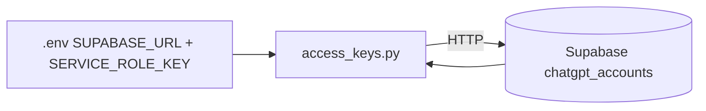

---

**create_boomlify_account.py**
Purpose: Log into Boomlify, click "Create", scrape the new email, and insert into Supabase.

Inputs / Outputs:
- `create_boomlify_account(login_email, login_password)` -> `new_email` or `None`

Return logic:
- Returns `None` if dashboard/creation/email scraping fails.
- Returns the new email string on success.

I/O picture:
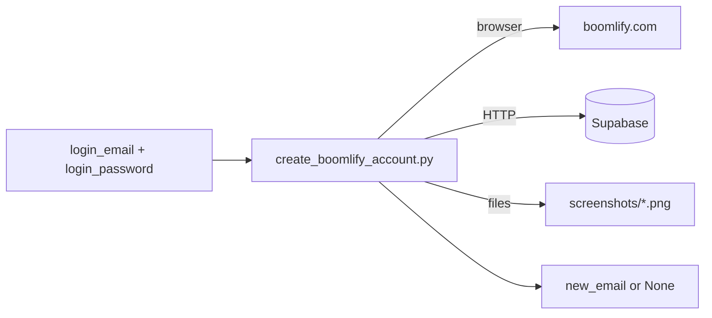

---

**create_chatgpt_account.py**
Purpose: End-to-end ChatGPT account creation using email + OTP.

Inputs / Outputs:
- `create_chatgpt_account(email)` -> `True` on success, `False` on failure

Return logic:
- Retries up to 5 attempts.
- Returns `True` after onboarding (or if chat UI is already visible).
- Updates Supabase password when signup succeeds.

I/O picture:
```mermaid
flowchart LR
  IN[email] --> CCA[create_chatgpt_account.py]
  CCA -->|browser| CHATGPT[chatgpt.com]
  CCA -->|browser| BOOM[boomlify.com (OTP)]
  CCA -->|HTTP| SB[(Supabase update_password)]
  CCA -->|files| SS[screenshots/*.png]
  CCA --> OUT[True/False]
```

---

**create_boomGpt.py**
Purpose: Orchestrator that creates a Boomlify inbox, then creates a ChatGPT account using that inbox.

Inputs / Outputs:
- `create_boomgpt(boomlify_login_email, boomlify_login_password)` -> `(ok: bool, new_email or None)`

Return logic:
- Returns `(False, None)` if Boomlify inbox creation fails.
- Returns `(True, new_email)` when ChatGPT signup succeeds.

I/O picture:
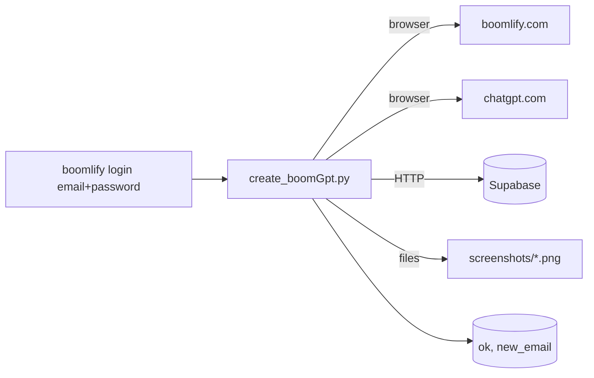

---

**get_boomlify_code.py**
Purpose: Open Boomlify in a separate session, search for the email, and extract OTP.

Inputs / Outputs:
- `fetch_chatgpt_code_from_boomlify_separate(search_email, login_email, login_password, total_timeout)`
  -> `code` (6 digits), `None` (not found), or `-1` (access deactivated)

Return logic:
- `-1` when Boomlify shows "Access Deactivated".
- `None` when no OTP found before timeout.

I/O picture:
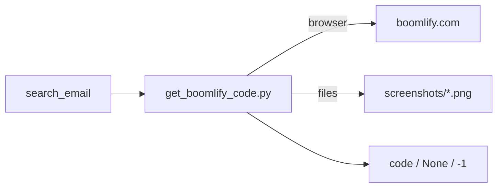

---

**handle_login.py**
Purpose: Robust login handling with retries, OTP, and password reset fallback.

Inputs / Outputs:
- `_handle_login_once(sb, email, password)` -> `"ok" | "verification" | "password_incorrect" | "reopen"`
- `_submit_verification_code(sb, email)` -> `True/False`
- `handle_login(email, password, sb=None)` -> `(ok: bool, sb_or_none)`

Return logic:
- `"verification"` -> fetch OTP via Boomlify and continue.
- `"password_incorrect"` -> call `reset_password`, then retry.
- `"reopen"` -> retry (same session for 2 attempts, then new sessions).

I/O picture:
```mermaid
flowchart LR
  IN[email+password] --> HL[handle_login.py]
  HL -->|browser| CHATGPT[chatgpt.com]
  HL -->|browser| BOOM[boomlify.com (OTP)]
  HL -->|HTTP| SB[(Supabase via reset_password)]
  HL -->|files| SS[screenshots/*.png]
  HL --> OUT[(ok, session)]
```

---

**password_reset_chatgpt.py**
Purpose: Reset a ChatGPT password if login fails.

Inputs / Outputs:
- `reset_password(email, password)` -> existing password, new password, or `None`
- `_generate_password(length=15)` -> random password string

Return logic:
- If current password works -> returns it (no reset).
- If not, completes reset flow and returns new password.
- If password is empty in Supabase, it skips the "already correct" shortcut and resets.

I/O picture:
```mermaid
flowchart LR
  IN[email+password] --> PR[password_reset_chatgpt.py]
  PR -->|browser| CHATGPT[platform.openai.com]
  PR -->|browser| BOOM[boomlify.com (OTP)]
  PR -->|HTTP| SB[(Supabase update_password)]
  PR -->|files| SS[screenshots/*.png]
  PR --> OUT[new_password or None]
```

---

**activate_search_mode.py**
Purpose: Types "/search" into ChatGPT and activates search mode.

Inputs / Outputs:
- `activate_search_mode(sb)` -> `None`

I/O picture:
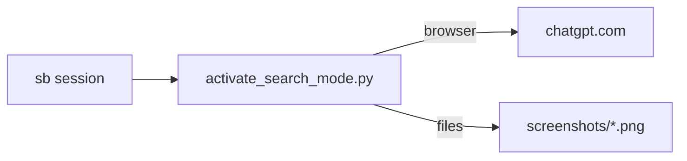

---

**utils.py**
Purpose: shared helpers (sleeping, clicking, screenshots, onboarding, input filling).

Key inputs / outputs:
- `sleep_dbg/short_sleep_dbg` -> sleep + return seconds
- `visible` -> `True/False`
- `click_first(sb, selectors, label="", raise_on_fail=False)` -> selector string or `None`
- `safe_wait_visible/safe_click/safe_type/safe_send_keys` -> `True/False`
- `save_ss` -> screenshot file path
- `_complete_onboarding(...)` -> `True/False`
- `_generate_password` -> random password string

I/O picture:
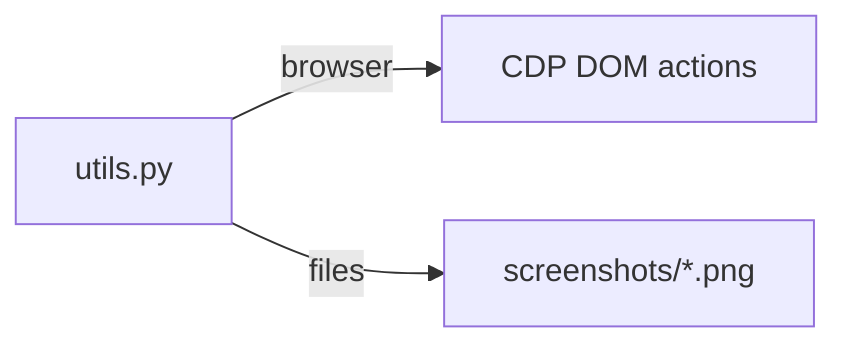

---

**is_pages/is_login_page.py**
Purpose: detect whether the login page is visible.

Inputs / Outputs:
- `is_login_page_visible(sb)` -> `True/False`

I/O picture:
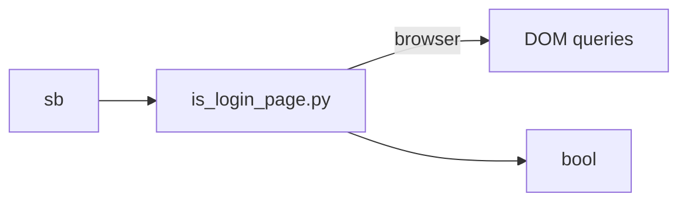

---

**is_pages/is_chat_ui.py**
Purpose: detect whether Chat UI textarea is visible on the current page.

Inputs / Outputs:
- `is_chat_ui_visible(sb)` -> `True/False`

I/O picture:
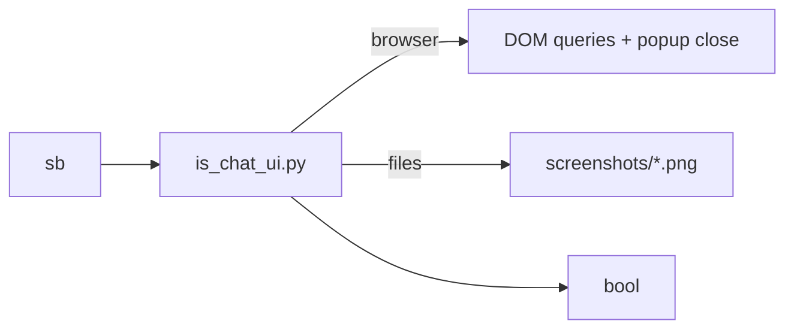

---

**is_pages/is_incorrect_page.py**
Purpose: detect incorrect credentials error.

Inputs / Outputs:
- `is_incorrect_credentials_page_visible(sb, timeout=5, screenshot_name=...)` -> `True/False`

I/O picture:
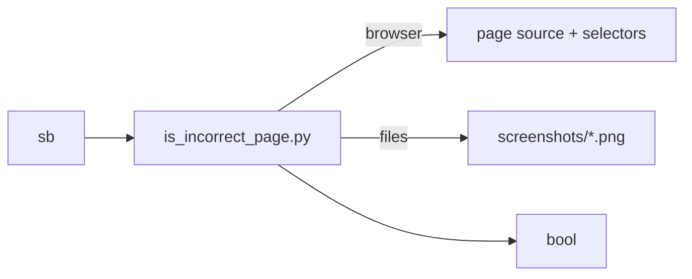

---

**is_pages/is_verification_page.py**
Purpose: detect OTP verification screen.

Inputs / Outputs:
- `is_verification_page_visible(sb, timeout=12, screenshot_name=...)` -> `True/False`

I/O picture:
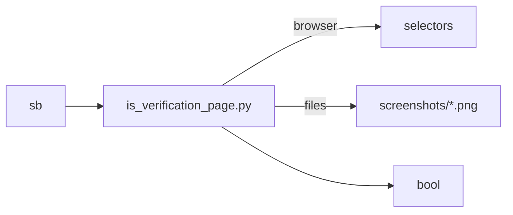

---

**is_pages/is_pop_ups.py**
Purpose: detect and close common popup dialogs/buttons.

Inputs / Outputs:
- `is_popups_visible(sb, timeout=4, screenshot_name=...)` -> `True/False`

I/O picture:
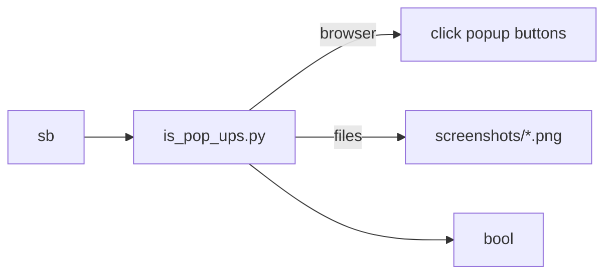

---

**is_pages/__init__.py**
Purpose: package marker (empty file).

Inputs / Outputs:
- none

I/O picture:
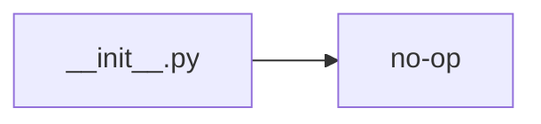
